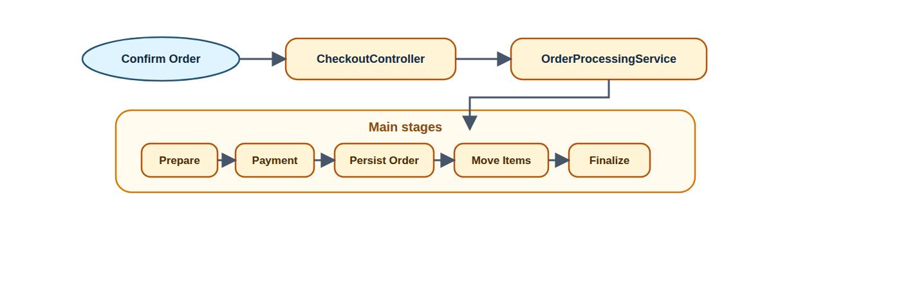
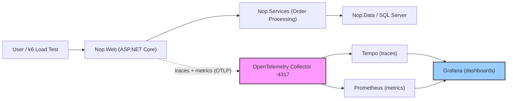

# AS- Assignment 01 - Observability

OpenTelemetry instrumentation for nopCommerce, focused on the flow:

**Customer places an order (Checkout -> Payment -> Order -> Inventory)**.

This repository contains:
- architecture analysis: `ARCHITECTURE_ANALYSIS.md`
- critique: `CRITIQUE.md`
- load test scripts: `loadtests/k6/*.js`
- observability stack: `docker-compose.observability.yml`

---

## 1) Prerequisites

- Docker + Docker Compose
- .NET SDK 9
- k6 (for load testing)

Check if you have the required tools:

```bash
docker --version
docker compose version
dotnet --version
k6 version
```

---

## 2) Run Observability Stack

The observability stack includes OpenTelemetry Collector, Tempo (traces), Prometheus (metrics), and Grafana (dashboards).

```bash
docker compose -f docker-compose.yml -f docker-compose.observability.yml up -d --build
```

Wait for containers to start:

```bash
docker compose -f docker-compose.yml -f docker-compose.observability.yml ps
```

Endpoints:
- **Store**: `http://localhost`
- **Grafana**: `http://localhost:3000` (admin/admin)
- **Prometheus**: `http://localhost:9090`
- **Tempo**: `http://localhost:3200`
- **OTEL Collector OTLP**: `http://localhost:4317` (gRPC), `http://localhost:4318` (HTTP)

---

## 3) Database Configuration

nopCommerce uses SQL Server running in Docker (configured in `docker-compose.yml`).

The database container is automatically started with the compose command. Connection details:
- **Host**: `nopcommerce_database` (inside Docker network) or `localhost:1433` (from host)
- **Database**: `nopCommerce`
- **User**: `sa`
- **Password**: `nopCommerce_db_password`

The database is created automatically on first run.

---

## 4) Install nopCommerce

On first run, nopCommerce needs to be installed through the web installer:

```bash
INSTALL_ADMIN_EMAIL=admin@yourStore.com \
INSTALL_ADMIN_PASSWORD=Admin123! \
INSTALL_SAMPLE_DATA=true \
INSTALL_DB_SERVER=nopcommerce_database \
INSTALL_DB_NAME=nopCommerce \
INSTALL_DB_USER=sa \
INSTALL_DB_PASSWORD=nopCommerce_db_password \
CREATE_DATABASE_IF_NOT_EXISTS=true \
BASE_URL=http://localhost \
COMPOSE_CMD='docker compose -f docker-compose.yml -f docker-compose.observability.yml' \
APP_CONTAINER_NAME=nopcommerce \
bash ./scripts/install-nopcommerce.sh
```

This will:
1. Start the stack
2. Wait for the app to be ready
3. Automatically complete the installation via the web UI
4. Install sample data (products, categories, customers)

After installation completes, the store is ready at `http://localhost`.

Verify installation by opening `http://localhost` in your browser. If you see the store (not the installation page), it's ready.

Default admin credentials:
- **Email**: `admin@yourStore.com`
- **Password**: `Admin123!`

---

## 5) Selected Flow Diagram



*Visual representation of the checkout flow from user browser through all internal stages. [View SVG](docs/diagrams/checkout-flow.svg) for scalable version.*

```mermaid
flowchart LR
  A["User Browser"] --> B["CheckoutController.OpcConfirmOrder"]
  B --> C["IOrderProcessingService.PlaceOrderAsync"]
  C --> D["Prepare stage: validation"]
  D --> E["Payment stage: process payment"]
  E --> F["Persist order stage: save to DB"]
  F --> G["Move items stage: cart -> order"]
  G --> H["Finalize stage: inventory + events"]
  H --> I["Order success/failure response"]
```

<details>
<summary>Mermaid source (click to expand)</summary>


</details>

### 5.1) Observability Architecture Diagram


*Complete observability stack showing application layers, telemetry pipeline, and visualization. [View SVG](docs/diagrams/observability-architecture.svg) for scalable version.*

<details>
<summary>Mermaid source (click to expand)</summary>


</details>

---

## 6) Instrumented Checkout Stages

The checkout flow is instrumented at these boundaries:

1. **HTTP Request** - ASP.NET Core auto-instrumentation
2. **`nop.checkout.place_order`** - Root checkout span (decorator around `IOrderProcessingService`)
3. **Checkout Stages** - Internal orchestration spans:
   - `nop.checkout.prepare` - Validation, captcha, minimum interval
   - `nop.checkout.payment` - Payment processing
   - `nop.checkout.persist_order` - Order persistence
   - `nop.checkout.move_items` - Cart items → order items
   - `nop.checkout.finalize` - Inventory adjustment, events
4. **`nop.repository.*`** - Database write operations
5. **`nop.event.publish`** - Internal event publishing

Each stage records:
- **Trace spans** with tags (mode, stage, outcome, reason_code, subsystem)
- **Metrics**: attempts, completions (success/failure), duration, active checkouts

---

## 7) Custom Metrics

The implementation tracks these OpenTelemetry metrics:

### `nop.checkout.attempts_total` (Counter)
- **Purpose**: Tracks when checkout stages are attempted (before outcome is known)
- **Labels**: `checkout_mode`, `stage`
- **Use case**: Funnel analysis - calculate dropoff rate

### `nop.checkout.stage_completions_total` (Counter)
- **Purpose**: Tracks success and failure completions for each stage
- **Labels**: `checkout_mode`, `stage`, `outcome`, `reason_code`, `subsystem`
- **Use case**: Error rate, success rate, failure classification

### `nop.checkout.stage_duration_ms` (Histogram)
- **Purpose**: Latency per checkout stage
- **Labels**: `checkout_mode`, `stage`, `outcome`, `payment.method.system` (for payment stage)
- **Use case**: Identify which stage is slow (p50, p95, p99)

### `nop.checkout.completion_time_ms` (Histogram)
- **Purpose**: End-to-end checkout completion time
- **Labels**: `checkout_mode`, `outcome`, `payment.method.system`
- **Use case**: Overall user experience latency

### `nop.checkout.active` (UpDownCounter)
- **Purpose**: In-flight checkout requests
- **Labels**: `checkout_mode`
- **Use case**: Current load, capacity monitoring

**Subsystem Labels** (for failure attribution):
- `basket` - Shopping cart validation failures
- `inventory` - Stock availability failures
- `payment_provider` - External payment failures
- `order_processing` - Order creation/persistence failures
- `general` - Other failures

---

## 8) Run Load Tests

The repository includes several load test profiles using k6.

### Quick Smoke Test (1 iteration)

```bash
docker run --rm --network host \
  -e BASE_URL=http://localhost \
  -e PAYMENT_METHOD=Payments.Manual \
  -v "$(pwd)/loadtests/k6:/scripts" \
  grafana/k6:0.49.0 run --vus 1 --iterations 1 /scripts/checkout-observability.js
```

### Default Load Test (staged ramp-up)

```bash
docker run --rm --network host \
  -e BASE_URL=http://localhost \
  -e PAYMENT_METHOD=Payments.Manual \
  -e THINK_TIME_SECONDS=1 \
  -v "$(pwd)/loadtests/k6:/scripts" \
  grafana/k6:0.49.0 run /scripts/checkout-observability.js
```

Default profile:
- Stage 1: 0 → 10 VUs (30s)
- Stage 2: 10 → 50 VUs (2m)
- Stage 3: 50 → 100 VUs (3m)
- Stage 4: 100 → 0 VUs (30s)

### Steady Load (fixed VUs, continuous)

```bash
docker run --rm --network host \
  -e BASE_URL=http://localhost \
  -e PAYMENT_METHOD=Payments.Manual \
  -e K6_FIXED_VUS=5 \
  -e K6_FIXED_DURATION=24h \
  -v "$(pwd)/loadtests/k6:/scripts" \
  grafana/k6:0.49.0 run /scripts/checkout-observability-steady.js
```

Adjust `K6_FIXED_VUS` for different load levels (5, 10, 20, 30, 50, 100).

### Realistic User Abandonment Test

```bash
docker run --rm --network host \
  -e BASE_URL=http://localhost \
  -e PAYMENT_METHOD=Payments.Manual \
  -e ADD_TO_CART_PATH=/addproducttocart/catalog/5/1/1 \
  -e IMPATIENT_USER_PERCENT=0.30 \
  -e NORMAL_REQUEST_TIMEOUT=10s \
  -e IMPATIENT_CONFIRM_TIMEOUT=3s \
  -e K6_STAGE_1_DURATION=30s \
  -e K6_STAGE_1_TARGET=10 \
  -e K6_STAGE_2_DURATION=2m \
  -e K6_STAGE_2_TARGET=15 \
  -e K6_STAGE_3_DURATION=3m \
  -e K6_STAGE_3_TARGET=15 \
  -e K6_STAGE_4_DURATION=30s \
  -e K6_STAGE_4_TARGET=0 \
  -v "$(pwd)/loadtests/k6:/scripts" \
  grafana/k6:0.49.0 run /scripts/checkout-realistic-abandonment.js
```

This test simulates real user behavior:
- 70% of users wait patiently
- 30% of users are impatient (3s timeout on confirm order)
- Generates dropoff metrics when slow responses occur

### Controlled Failure Tests

**Business validation failures:**

```bash
docker run --rm --network host \
  -e BASE_URL=http://localhost \
  -e PAYMENT_METHOD=Payments.Manual \
  -e ADD_TO_CART_PATH=/addproducttocart/catalog/18/1/1 \
  -e K6_FIXED_VUS=1 \
  -e K6_FIXED_DURATION=3m \
  -e THINK_TIME_SECONDS=2 \
  -v "$(pwd)/loadtests/k6:/scripts" \
  grafana/k6:0.49.0 run /scripts/checkout-business-failure.js
```

Uses a product configured to fail (e.g., out of stock, minimum order subtotal not met).

**Minimum order interval failures:**

Run the script:

```bash
bash ./scripts/run-min-interval-load.sh
```

Triggers "minimum interval between orders" validation failures.

### Controlled Degradation (for dashboard demo)

```bash
# Start stack with resource constraints
docker compose -f docker-compose.yml -f docker-compose.observability.yml -f docker-compose.loadtest.yml up -d --build

# Run degradation profile (creates interesting graphs without crashing)
docker run --rm --network host \
  -e BASE_URL=http://localhost \
  -e K6_STAGE_1_DURATION=30s \
  -e K6_STAGE_1_TARGET=15 \
  -e K6_STAGE_2_DURATION=2m \
  -e K6_STAGE_2_TARGET=30 \
  -e K6_STAGE_3_DURATION=2m \
  -e K6_STAGE_3_TARGET=40 \
  -e K6_STAGE_4_DURATION=30s \
  -e K6_STAGE_4_TARGET=0 \
  -v "$(pwd)/loadtests/k6:/scripts" \
  grafana/k6:0.49.0 run /scripts/checkout-observability.js

# Stop when done
docker compose -f docker-compose.yml -f docker-compose.observability.yml -f docker-compose.loadtest.yml down
```

This profile gradually increases load to show degradation in the dashboard:
- Stage 1: 0 → 15 VUs (30s)
- Stage 2: 15 → 30 VUs (2m)
- Stage 3: 30 → 40 VUs (2m)
- Stage 4: 40 → 0 VUs (30s)

---

## 9) Dashboard Validation

Open Grafana at `http://localhost:3000` (admin/admin).

Navigate to:
1. **Dashboards** → **Commerce Operations** → **Checkout Observability**

The dashboard includes these panels:

### Top Row (Health Indicators)
- **Checkout Error Rate (%)** - Current error rate (required metric)
- **Active Checkouts** - In-flight requests
- **Median Checkout Time (p50)** - Typical user experience

### Row 2 (Stage Analysis)
- **Checkout Stage Latency (p95 / p99)** - Which stage is slow?
- **Stage Success Rate** - Early warning indicator (detects degradation before critical errors)

### Row 3 (Failure Analysis)
- **Checkout Failures by Stage and Reason** - What's failing and why?
- **Checkout Error Rate Over Time** - When did problems start?

### Row 4 (Advanced Diagnostics)
- **Dropoff Rate by Stage (%)** - User abandonment/timeout rate
- **Failures by Subsystem** - Which component is failing? (basket, inventory, payment_provider, order_processing)

### Bottom Row (Trace Drilldown)
- **Latest Checkout Traces** - Link to Tempo for detailed trace inspection

### Dashboard Variables

The dashboard includes template variables for filtering:
- **`$stage`**: Filter by stage (prepare, payment, persist_order, move_items, finalize, or All)
- **`$interval`**: Rate window (1m, 2m, 5m, 10m) - default 2m

---

## 10) Key Prometheus Queries

### Checkout Error Rate

```promql
100 * sum(rate(nop_checkout_stage_completions_total{outcome="failure"}[2m]))
  / sum(rate(nop_checkout_stage_completions_total[2m]))
```

### Stage Success Rate (Early Warning)

```promql
100 * (sum by (stage) (rate(nop_checkout_stage_completions_total{outcome="success"}[2m]))
  / sum by (stage) (rate(nop_checkout_stage_completions_total[2m])))
```

### Dropoff Rate (Abandonment)

```promql
100 * ((rate(nop_checkout_attempts_total[2m])
  - rate(nop_checkout_stage_completions_total[2m]))
  / clamp_min(rate(nop_checkout_attempts_total[2m]), 0.000001))
```

### Failures by Subsystem

```promql
sum by (subsystem) (rate(nop_checkout_stage_completions_total{outcome="failure",subsystem=~".+"}[2m]))
```

### Checkout Latency (p50, p95, p99)

```promql
histogram_quantile(0.50, sum(rate(nop_checkout_completion_time_ms_bucket[2m])) by (le))
histogram_quantile(0.95, sum(rate(nop_checkout_completion_time_ms_bucket[2m])) by (le))
histogram_quantile(0.99, sum(rate(nop_checkout_completion_time_ms_bucket[2m])) by (le))
```

### Stage-Specific Latency

```promql
histogram_quantile(0.95, sum by (stage, le) (rate(nop_checkout_stage_duration_ms_bucket[2m])))
```

---

## 11) Trace View (Tempo)

Traces are automatically exported to Tempo and can be viewed in Grafana:

1. Open Grafana → **Explore**
2. Select **Tempo** datasource
3. Query by:
   - **Service**: `nopcommerce-web`
   - **Span Name**: `nop.checkout.place_order`
   - **Time Range**: Last 15 minutes

Or use the **Latest Checkout Traces** panel in the dashboard for quick access.

Example trace structure:

```
POST /Checkout/OpcConfirmOrder
└── nop.checkout.place_order
    ├── nop.checkout.prepare
    ├── nop.checkout.payment
    ├── nop.checkout.persist_order
    │   ├── nop.repository.insert (Order)
    │   └── nop.event.publish (EntityInsertedEvent<Order>)
    ├── nop.checkout.move_items
    │   └── nop.repository.delete (ShoppingCartItem)
    └── nop.checkout.finalize
        ├── nop.repository.update (Product - inventory)
        └── nop.event.publish (OrderPlacedEvent)
```

---

## 12) Deliverables in Repo

- **`ARCHITECTURE_ANALYSIS.md`** - Architecture analysis and observability design
- **`CRITIQUE.md`** - Architectural critique and reflection
- **`loadtests/k6/`** - Load test scripts
- **`observability/`** - OpenTelemetry Collector, Tempo, Prometheus, Grafana configs
- **`observability/grafana/dashboards/`** - Provisioned Grafana dashboard

---

## 13) Useful Commands

```bash
# Start/stop stack
docker compose -f docker-compose.yml -f docker-compose.observability.yml up -d --build
docker compose -f docker-compose.yml -f docker-compose.observability.yml down
docker compose -f docker-compose.yml -f docker-compose.observability.yml up -d --build --force-recreate

# View logs
docker compose -f docker-compose.yml -f docker-compose.observability.yml logs -f
docker logs -f nopcommerce
docker compose -f docker-compose.yml -f docker-compose.observability.yml logs -f otel-collector
docker compose -f docker-compose.yml -f docker-compose.observability.yml logs -f grafana

# Check status
docker compose -f docker-compose.yml -f docker-compose.observability.yml ps
```

---

## 14) Implementation Highlights

### Boundary-Based Instrumentation

Observability is added at architectural boundaries instead of scattering it everywhere:
- **Decorator** around `IOrderProcessingService` for root checkout span
- **Repository layer** for database operations
- **Event publisher** for event fan-out
- **Controller layer** for HTTP entry points

### Privacy by Design

A central `SensitiveActivitySanitizingProcessor` removes sensitive data before export:
- Credit card numbers, CVV, expiry
- Customer email, phone, IP
- Full URLs with query strings
- Exception messages with PII
- Address data
- Payment transaction IDs

### Modular Telemetry Design

- **`NopTelemetry`** - Shared primitives (ActivitySource, Meter)
- **`CheckoutTelemetry`** - Checkout-specific tags, metrics, helpers
- Future areas (catalog, search, etc.) can add their own telemetry modules without coupling

### Early Warning Metrics

The **Stage Success Rate** metric provides early warning of degradation:
- Tracks both success AND failure (not just failures)
- Shows degradation before error rate becomes critical
- Example: Payment stage at 97% success alerts before 5% overall error rate

### Failure Attribution

The **subsystem label** immediately shows which component is failing:
- `basket` → Alert cart/validation team
- `inventory` → Alert inventory/stock team
- `payment_provider` → Alert payments/gateway team
- `order_processing` → Alert backend/database team

---
