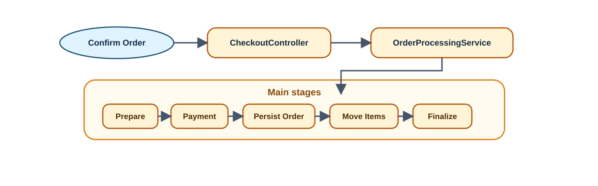
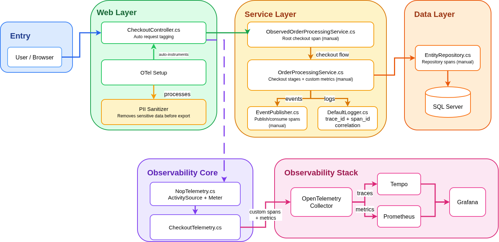
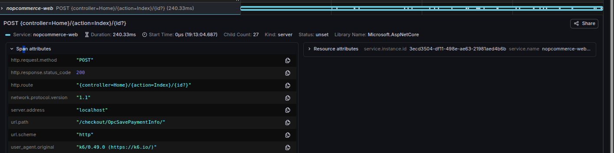
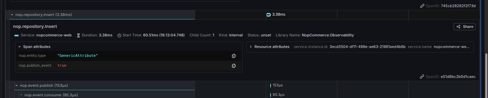

# AS- Assignment 01 - Observability

OpenTelemetry instrumentation for nopCommerce, focused on the flow:

**Customer places an order (Checkout -> Payment -> Order -> Inventory)**.

This repository contains:
- architecture analysis: `ANALYSIS.md`
- observability report: `report.md`
- critique: `CRITIQUE.md`
- load test scripts: `assessment/load-test/k6/*.js`
- observability stack: `docker-compose.observability.yml`

Assessment assets are grouped under `assessment/`:
- diagrams: `assessment/diagrams/`
- dashboards: `assessment/dashboards/`
- load test assets: `assessment/load-test/`
- observability config: `assessment/observability/`

---

## 1) Prerequisites

- Docker + Docker Compose
- .NET SDK 9
- k6 (for load testing)

Check if you have the required tools:

```bash
docker --version
docker compose version
dotnet --version
k6 version
```

---

## 2) Run Observability Stack

The observability stack includes OpenTelemetry Collector, Tempo (traces), Prometheus (metrics), and Grafana (dashboards).

```bash
docker compose -f docker-compose.yml -f docker-compose.observability.yml up -d --build
```

Wait for containers to start:

```bash
docker compose -f docker-compose.yml -f docker-compose.observability.yml ps
```

Endpoints:
- **Store**: `http://localhost`
- **Grafana**: `http://localhost:3000` (admin/admin)
- **Prometheus**: `http://localhost:9090`
- **Tempo**: `http://localhost:3200`
- **OTEL Collector OTLP**: `http://localhost:4317` (gRPC), `http://localhost:4318` (HTTP)

---

## 3) Database Configuration

nopCommerce uses SQL Server running in Docker (configured in `docker-compose.yml`).

The database container is automatically started with the compose command. Connection details:
- **Host**: `nopcommerce_database` (inside Docker network) or `localhost:1433` (from host)
- **Database**: `nopCommerce`
- **User**: `sa`
- **Password**: `nopCommerce_db_password`

The database is created automatically on first run.

---

## 4) Install nopCommerce

On first run, nopCommerce needs to be installed through the web installer:

```bash
INSTALL_ADMIN_EMAIL=admin@yourStore.com \
INSTALL_ADMIN_PASSWORD=Admin123! \
INSTALL_SAMPLE_DATA=true \
INSTALL_DB_SERVER=nopcommerce_database \
INSTALL_DB_NAME=nopCommerce \
INSTALL_DB_USER=sa \
INSTALL_DB_PASSWORD=nopCommerce_db_password \
CREATE_DATABASE_IF_NOT_EXISTS=true \
BASE_URL=http://localhost \
COMPOSE_CMD='docker compose -f docker-compose.yml -f docker-compose.observability.yml' \
APP_CONTAINER_NAME=nopcommerce \
bash ./scripts/install-nopcommerce.sh
```

This will:
1. Start the stack
2. Wait for the app to be ready
3. Automatically complete the installation via the web UI
4. Install sample data (products, categories, customers)

After installation completes, the store is ready at `http://localhost`.

Verify installation by opening `http://localhost` in your browser. If you see the store (not the installation page), it's ready.

Default admin credentials:
- **Email**: `admin@yourStore.com`
- **Password**: `Admin123!`

---

## 5) Selected Flow Diagram




### 5.1) Observability Architecture Diagram




---

## 6) Instrumented Checkout Stages

The checkout flow is instrumented at these boundaries:

1. **HTTP Request** - ASP.NET Core auto-instrumentation
2. **`nop.checkout.place_order`** - Root checkout span (decorator around `IOrderProcessingService`)
3. **Checkout Stages** - Internal orchestration spans:
   - `nop.checkout.prepare` - Validation, captcha, minimum interval
   - `nop.checkout.payment` - Payment processing
   - `nop.checkout.persist_order` - Order persistence
   - `nop.checkout.move_items` - Cart items → order items
   - `nop.checkout.finalize` - Inventory adjustment, events
4. **`nop.repository.*`** - Database write operations
5. **`nop.event.publish`** - Internal event publishing

Each stage records:
- **Trace spans** with tags (mode, stage, outcome, reason_code, subsystem)
- **Metrics**: completions (success/failure), duration, and end-to-end completion time

---

## 7) Custom Metrics

The implementation tracks these OpenTelemetry metrics:

### `nop.checkout.stage_completions_total` (Counter)
- **Purpose**: Tracks success and failure completions for each stage
- **Labels**: `checkout_mode`, `stage`, `outcome`, `reason_code`, `subsystem`
- **Use case**: Failure rate, failure classification, stage-level diagnosis

### `nop.checkout.stage_duration_ms` (Histogram)
- **Purpose**: Latency per checkout stage
- **Labels**: `checkout_mode`, `stage`, `outcome`, `payment.method.system` (for payment stage)
- **Use case**: Identify which internal backend stage is slow (especially p95)

### `nop.checkout.completion_time_ms` (Histogram)
- **Purpose**: End-to-end backend order-placement time after `Confirm Order`
- **Labels**: `checkout_mode`, `outcome`, `payment.method.system`
- **Use case**: Throughput, failure rate denominator, headline latency

### `nop.checkout.repository_write_duration_ms` (Histogram)
- **Purpose**: Measures database write latency during checkout at the repository boundary
- **Labels**: `checkout_mode`, `operation`, `entity_group`, `outcome`
- **Use case**: Distinguish persistence bottlenecks from business-logic bottlenecks inside `persist_order`

**Subsystem Labels** (for failure attribution):
- `basket` - Shopping cart validation failures
- `inventory` - Stock availability failures
- `payment_provider` - External payment failures
- `order_processing` - Order creation/persistence failures
- `general` - Other failures

---

## 8) Run Load Tests

The repository includes a few load-test scenarios, but there are **two main runs** to use for the assignment/demo:

1. **Normal checkout load with 15 VUs** using `assessment/load-test/k6/checkout-observability.js`
2. **Multi-error failure demo** using `scripts/run-min-subtotal-load.sh`, which drives several controlled business failures so the dashboard shows different error types

The main goal is to exercise the backend order-placement flow after `Confirm Order`, not model UI abandonment.

### Quick Smoke Test (1 iteration)

Verify the checkout flow works end-to-end:

```bash
docker run --rm --network host \
  -e BASE_URL=http://localhost \
  -e PAYMENT_METHOD=Payments.Manual \
  -v "$(pwd)/assessment/load-test/k6:/scripts" \
  grafana/k6:0.49.0 run --vus 1 --iterations 1 /scripts/checkout-observability.js
```

---

### Main Load Test: Normal Checkout (15 VUs)

**File:** `assessment/load-test/k6/checkout-observability.js`

This is the main happy-path load test for the dashboard and demo. It drives the normal one-page checkout flow until `OpcConfirmOrder`, which then exercises `OrderProcessingService.PlaceOrderAsync` and the internal backend stages. The key target is the **15 VU stage**.

```bash
docker run --rm --network host \
  -e BASE_URL=http://localhost \
  -e PAYMENT_METHOD=Payments.Manual \
  -e THINK_TIME_SECONDS=1 \
  -e K6_STAGE_1_DURATION=30s \
  -e K6_STAGE_1_TARGET=5 \
  -e K6_STAGE_2_DURATION=2m \
  -e K6_STAGE_2_TARGET=10 \
  -e K6_STAGE_3_DURATION=3m \
  -e K6_STAGE_3_TARGET=15 \
  -e K6_STAGE_4_DURATION=30s \
  -e K6_STAGE_4_TARGET=0 \
  -v "$(pwd)/assessment/load-test/k6:/scripts" \
  grafana/k6:0.49.0 run /scripts/checkout-observability.js
```

**What it demonstrates:**
- End-to-end backend order placement after `Confirm Order`
- Throughput changes under load
- p95 completion latency and p95 stage latency
- Failure-rate and trace drilldown when errors occur

**Metrics generated:**
- `nop.checkout.completion_time_ms`
- `nop.checkout.stage_duration_ms`
- `nop.checkout.stage_completions_total`

This is the **main normal-load test** because it aligns directly with the metrics and traces being analyzed and gives the cleanest 15 VU baseline.

---

### Main Failure Test: Different Error Types

**Script:** `scripts/run-min-subtotal-load.sh`

This is the main failure-demo run. It updates nopCommerce settings between phases and then executes multiple controlled failure scenarios so the dashboard captures **different business errors** instead of only one failure mode.

It covers:

- minimum order subtotal failures
- minimum order interval failures
- minimum order total failures

Run it from the repository root:

```bash
bash ./scripts/run-min-subtotal-load.sh
```

What it demonstrates:

- multiple classified checkout failures in one run
- clearer `reason_code` and `subsystem` variety in Grafana
- failure trends while the application stays alive
- a better demo for "different errors" than a single low-noise failure script

The script internally uses the failure-oriented k6 scenarios under `assessment/load-test/k6/`, including `checkout-subtotal-failure.js`, `checkout-observability-steady.js`, and `checkout-business-failure.js`.

---

### Supporting Single Failure Scenario

**File:** `assessment/load-test/k6/checkout-business-failure.js`

This supporting test uses a **product configured to fail validation** (for example, out of stock or a minimum-order rule violation):

```bash
docker run --rm --network host \
  -e BASE_URL=http://localhost \
  -e PAYMENT_METHOD=Payments.Manual \
  -e ADD_TO_CART_PATH=/addproducttocart/catalog/18/1/1 \
  -e K6_FIXED_VUS=1 \
  -e K6_FIXED_DURATION=3m \
  -e THINK_TIME_SECONDS=2 \
  -v "$(pwd)/assessment/load-test/k6:/scripts" \
  grafana/k6:0.49.0 run /scripts/checkout-business-failure.js
```

**What it demonstrates:**
- **Controlled validation failures** (business rule violations)
- Low noise (1 VU) for clear failure patterns
- **Subsystem-specific failures** (e.g., `basket`, `inventory`)
- **Reason code tracking** (e.g., `validation`, `inventory_exception`)

**Metrics generated:**
- Failures tracked by `stage` and `reason_code`
- Subsystem attribution (`subsystem` label)
- Clean failure patterns in dashboard

This supporting test is useful when you want one isolated failure pattern instead of the multi-phase error demo above.

---

## 9) Dashboard Validation

Open Grafana at `http://localhost:3000` (admin/admin).

Navigate to:
1. **Dashboards** → **Commerce Operations** → **Checkout Observability**

The dashboard includes these panels:

### Top Row (Health Indicators)
- **Checkout Failure Rate (%)** - Current failure rate
- **Checkout Completion Latency p95** - Headline latency for backend order placement
- **Checkout Completion Latency p50** - Typical completion time for backend order placement
- **Checkouts In Range** - Total checkout attempts in the current time filter

### Row 2 (Latency Analysis)
- **Checkout Stage Latency** - Which backend stage is slow?
- **Successful vs Failed Completions Over Time** - When does traffic shift from success to failure?

### Row 3 (Failure Analysis)
- **Checkout Repository Write Latency p95** - Is the `persist_order` slowdown coming from repository writes?
- **Checkout Failure Rate Over Time** - When did problems start?

### Row 4 (Advanced Diagnostics)
- **Checkout Failures by Reason Code** - Which error class is dominant?

### Bottom Row (Trace Drilldown)
- **Latest Checkout Traces** - Recent checkout traces for the selected flow

### Dashboard Variables

The dashboard includes two template variables:
- **`$stage`**: Filter by stage (prepare, payment, persist_order, move_items, finalize, or All)
- **`$stage_latency_quantile`**: Select the percentile shown in the stage-latency panel (`p95` or `p50`)

Stat panels use the selected Grafana time range, and time-series panels use a fixed `1m` rate window in the provisioned dashboard.

---

## 10) Prometheus Queries

### Checkout Failure Rate (%)

```promql
(100 * sum(increase(nop_checkout_stage_completions_total{outcome="failure"}[$__range])) / clamp_min(sum(increase(nop_checkout_completion_time_ms_milliseconds_count{outcome="success"}[$__range])) + sum(increase(nop_checkout_stage_completions_total{outcome="failure"}[$__range])), 0.000001)) or on() vector(0)
```

### Checkout Completion Latency p95

```promql
histogram_quantile(0.95, sum(increase(nop_checkout_completion_time_ms_milliseconds_bucket[$__range])) by (le)) or on() vector(0)
```

### Checkout Completion Latency p50

```promql
histogram_quantile(0.50, sum(increase(nop_checkout_completion_time_ms_milliseconds_bucket[$__range])) by (le)) or on() vector(0)
```

### Completed Checkouts In Range

```promql
(sum(increase(nop_checkout_completion_time_ms_milliseconds_count{outcome="success"}[$__range])) + sum(increase(nop_checkout_stage_completions_total{outcome="failure"}[$__range]))) or on() vector(0)
```

### Checkout Repository Write Latency p95

```promql
histogram_quantile(0.95, sum by (le, operation, entity_group) (rate(nop_checkout_repository_write_duration_ms_milliseconds_bucket[1m])))
```

### Checkout Stage Latency (`${stage_latency_quantile:text}`)

```promql
histogram_quantile(${stage_latency_quantile:raw}, sum by (le, stage) (rate(nop_checkout_stage_duration_ms_milliseconds_bucket{stage=~"$stage"}[1m])))
```

### Successful vs Failed Completions Over Time

```promql
sum by (outcome) (rate(nop_checkout_completion_time_ms_milliseconds_count{outcome=~"success|failure"}[1m]))
```

### Checkout Failure Rate Over Time

```promql
(100 * sum(rate(nop_checkout_stage_completions_total{outcome="failure"}[1m])) / clamp_min(sum(rate(nop_checkout_completion_time_ms_milliseconds_count{outcome="success"}[1m])) + sum(rate(nop_checkout_stage_completions_total{outcome="failure"}[1m])), 0.000001)) or on() vector(0)
```

### Checkout Failures by Reason Code

```promql
sum by (reason_code) (increase(nop_checkout_stage_completions_total{outcome="failure",reason_code=~".+"}[$__range]))
```

---

## 11) Trace View (Tempo)

Traces are automatically exported to Tempo and can be viewed in Grafana:

1. Open Grafana → **Explore**
2. Select **Tempo** datasource
3. Query by:
   - **Service**: `nopcommerce-web`
   - **Span Name**: `nop.checkout.place_order`
   - **Time Range**: Last 15 minutes

Or use the **Latest Checkout Traces** panel in the dashboard for quick access.

Example trace structure:

```text
POST /checkout/OpcConfirmOrder
└── nop.checkout.place_order
    ├── nop.checkout.prepare
    ├── nop.checkout.payment
    ├── nop.checkout.persist_order
    │   └── nop.repository.*
    ├── nop.checkout.move_items
    └── nop.checkout.finalize
        └── nop.event.publish
```

Trace opened in Grafana Explore:



Nested repository and event spans inside the same trace:


